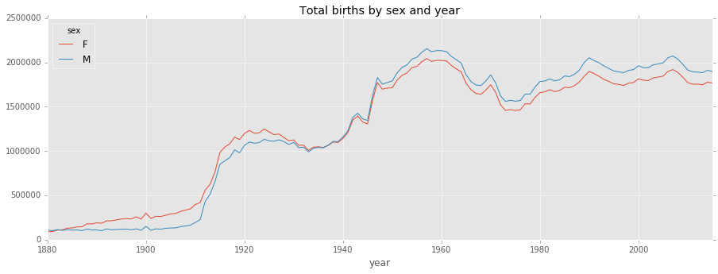
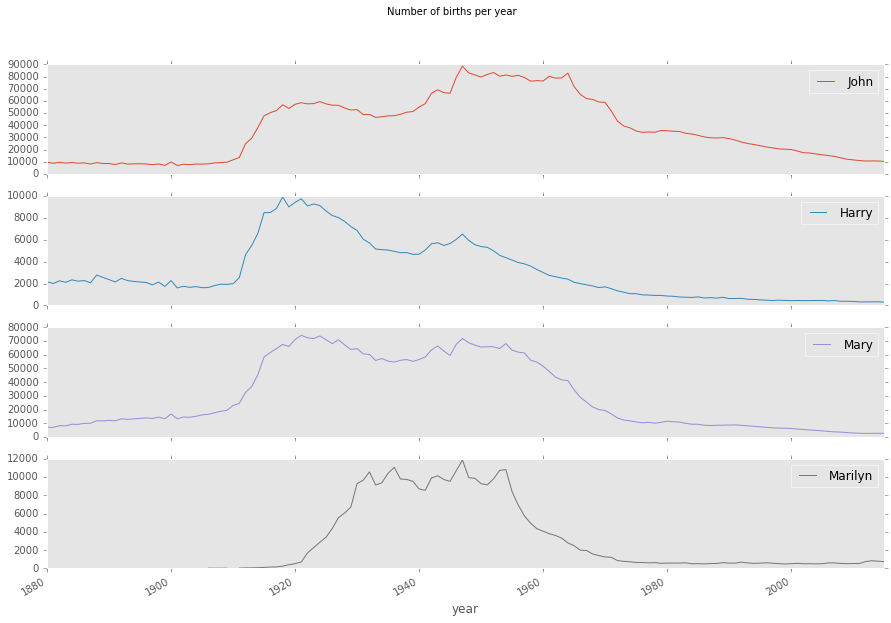
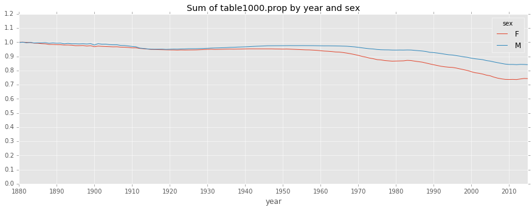
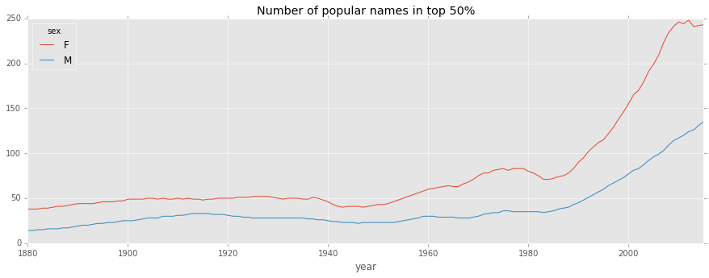
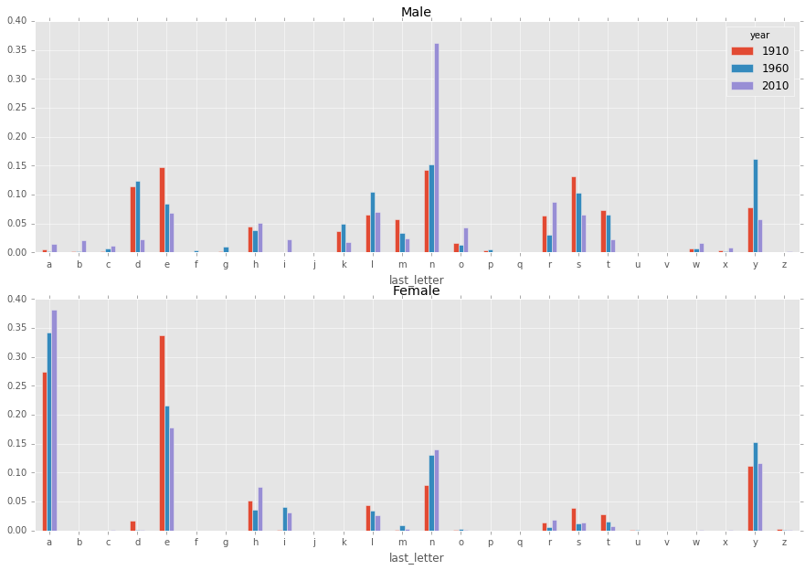
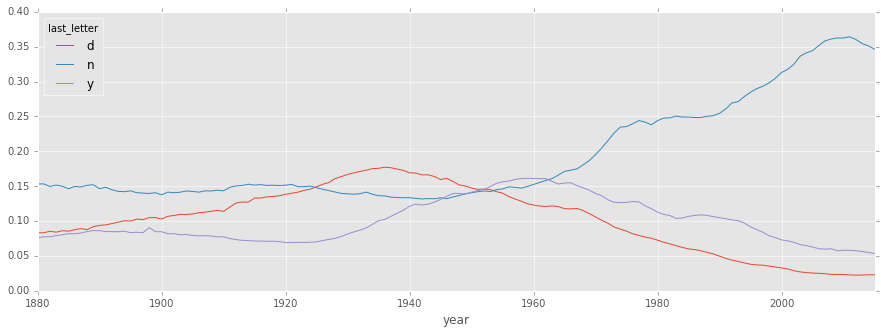
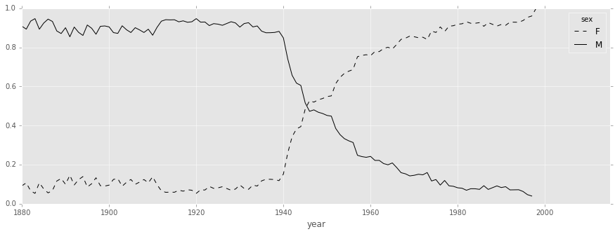

## Ch2_Introductory Examples
- 1.usa.gov data from bit.ly 17 
    - Counting Time Zones in Pure Python 19
    - Counting Time Zones with pandas 21 
- MovieLens 1M Data Set 26 
    - Measuring rating disagreement 30 
- US Baby Names 1880-2010 32 
    - Analyzing Naming Trends 36 
- Conclusions and The Path Ahead

## MovieLens 1M Data Set
- https://grouplens.org/datasets/movielens/


```python
import pandas as pd
```


```python
unames = ['user_id', 'gender', 'age', 'occupation', 'zip'] 
users = pd.read_table('/tmp/datasets/ml-1m/users.dat', sep='::', header=None, names=unames)
```

    /Users/chengil/miniconda2/lib/python2.7/site-packages/ipykernel/__main__.py:2: ParserWarning: Falling back to the 'python' engine because the 'c' engine does not support regex separators (separators > 1 char and different from '\s+' are interpreted as regex); you can avoid this warning by specifying engine='python'.
      from ipykernel import kernelapp as app


```python
rnames = ['user_id', 'movie_id', 'rating', 'timestamp']
ratings = pd.read_table('/tmp/datasets/ml-1m/ratings.dat', sep='::', header=None, names=rnames)
```

    /Users/chengil/miniconda2/lib/python2.7/site-packages/ipykernel/__main__.py:2: ParserWarning: Falling back to the 'python' engine because the 'c' engine does not support regex separators (separators > 1 char and different from '\s+' are interpreted as regex); you can avoid this warning by specifying engine='python'.
      from ipykernel import kernelapp as app


```python
mnames = ['movie_id', 'title', 'genres']
movies = pd.read_table('/tmp/datasets/ml-1m/movies.dat', sep='::', header=None, names=mnames)
```

    /Users/chengil/miniconda2/lib/python2.7/site-packages/ipykernel/__main__.py:2: ParserWarning: Falling back to the 'python' engine because the 'c' engine does not support regex separators (separators > 1 char and different from '\s+' are interpreted as regex); you can avoid this warning by specifying engine='python'.
      from ipykernel import kernelapp as app


```python
users.head()
```


<div>
<table border="1" class="dataframe">
  <thead>
    <tr style="text-align: right;">
      <th></th>
      <th>user_id</th>
      <th>gender</th>
      <th>age</th>
      <th>occupation</th>
      <th>zip</th>
    </tr>
  </thead>
  <tbody>
    <tr>
      <th>0</th>
      <td>1</td>
      <td>F</td>
      <td>1</td>
      <td>10</td>
      <td>48067</td>
    </tr>
    <tr>
      <th>1</th>
      <td>2</td>
      <td>M</td>
      <td>56</td>
      <td>16</td>
      <td>70072</td>
    </tr>
    <tr>
      <th>2</th>
      <td>3</td>
      <td>M</td>
      <td>25</td>
      <td>15</td>
      <td>55117</td>
    </tr>
    <tr>
      <th>3</th>
      <td>4</td>
      <td>M</td>
      <td>45</td>
      <td>7</td>
      <td>02460</td>
    </tr>
    <tr>
      <th>4</th>
      <td>5</td>
      <td>M</td>
      <td>25</td>
      <td>20</td>
      <td>55455</td>
    </tr>
  </tbody>
</table>
</div>


```python
ratings.head()
```


<div>
<table border="1" class="dataframe">
  <thead>
    <tr style="text-align: right;">
      <th></th>
      <th>user_id</th>
      <th>movie_id</th>
      <th>rating</th>
      <th>timestamp</th>
    </tr>
  </thead>
  <tbody>
    <tr>
      <th>0</th>
      <td>1</td>
      <td>1193</td>
      <td>5</td>
      <td>978300760</td>
    </tr>
    <tr>
      <th>1</th>
      <td>1</td>
      <td>661</td>
      <td>3</td>
      <td>978302109</td>
    </tr>
    <tr>
      <th>2</th>
      <td>1</td>
      <td>914</td>
      <td>3</td>
      <td>978301968</td>
    </tr>
    <tr>
      <th>3</th>
      <td>1</td>
      <td>3408</td>
      <td>4</td>
      <td>978300275</td>
    </tr>
    <tr>
      <th>4</th>
      <td>1</td>
      <td>2355</td>
      <td>5</td>
      <td>978824291</td>
    </tr>
  </tbody>
</table>
</div>


```python
movies.head()
```


<div>
<table border="1" class="dataframe">
  <thead>
    <tr style="text-align: right;">
      <th></th>
      <th>movie_id</th>
      <th>title</th>
      <th>genres</th>
    </tr>
  </thead>
  <tbody>
    <tr>
      <th>0</th>
      <td>1</td>
      <td>Toy Story (1995)</td>
      <td>Animation|Children's|Comedy</td>
    </tr>
    <tr>
      <th>1</th>
      <td>2</td>
      <td>Jumanji (1995)</td>
      <td>Adventure|Children's|Fantasy</td>
    </tr>
    <tr>
      <th>2</th>
      <td>3</td>
      <td>Grumpier Old Men (1995)</td>
      <td>Comedy|Romance</td>
    </tr>
    <tr>
      <th>3</th>
      <td>4</td>
      <td>Waiting to Exhale (1995)</td>
      <td>Comedy|Drama</td>
    </tr>
    <tr>
      <th>4</th>
      <td>5</td>
      <td>Father of the Bride Part II (1995)</td>
      <td>Comedy</td>
    </tr>
  </tbody>
</table>
</div>


```python
movies.info()
```

    <class 'pandas.core.frame.DataFrame'>
    RangeIndex: 3883 entries, 0 to 3882
    Data columns (total 3 columns):
    movie_id    3883 non-null int64
    title       3883 non-null object
    genres      3883 non-null object
    dtypes: int64(1), object(2)
    memory usage: 91.1+ KB


```python
data = pd.merge(pd.merge(ratings, users), movies)
```


```python
data.info()
```

    <class 'pandas.core.frame.DataFrame'>
    Int64Index: 1000209 entries, 0 to 1000208
    Data columns (total 10 columns):
    user_id       1000209 non-null int64
    movie_id      1000209 non-null int64
    rating        1000209 non-null int64
    timestamp     1000209 non-null int64
    gender        1000209 non-null object
    age           1000209 non-null int64
    occupation    1000209 non-null int64
    zip           1000209 non-null object
    title         1000209 non-null object
    genres        1000209 non-null object
    dtypes: int64(6), object(4)
    memory usage: 83.9+ MB


```python
data.head()
```


<div>
<table border="1" class="dataframe">
  <thead>
    <tr style="text-align: right;">
      <th></th>
      <th>user_id</th>
      <th>movie_id</th>
      <th>rating</th>
      <th>timestamp</th>
      <th>gender</th>
      <th>age</th>
      <th>occupation</th>
      <th>zip</th>
      <th>title</th>
      <th>genres</th>
    </tr>
  </thead>
  <tbody>
    <tr>
      <th>0</th>
      <td>1</td>
      <td>1193</td>
      <td>5</td>
      <td>978300760</td>
      <td>F</td>
      <td>1</td>
      <td>10</td>
      <td>48067</td>
      <td>One Flew Over the Cuckoo's Nest (1975)</td>
      <td>Drama</td>
    </tr>
    <tr>
      <th>1</th>
      <td>2</td>
      <td>1193</td>
      <td>5</td>
      <td>978298413</td>
      <td>M</td>
      <td>56</td>
      <td>16</td>
      <td>70072</td>
      <td>One Flew Over the Cuckoo's Nest (1975)</td>
      <td>Drama</td>
    </tr>
    <tr>
      <th>2</th>
      <td>12</td>
      <td>1193</td>
      <td>4</td>
      <td>978220179</td>
      <td>M</td>
      <td>25</td>
      <td>12</td>
      <td>32793</td>
      <td>One Flew Over the Cuckoo's Nest (1975)</td>
      <td>Drama</td>
    </tr>
    <tr>
      <th>3</th>
      <td>15</td>
      <td>1193</td>
      <td>4</td>
      <td>978199279</td>
      <td>M</td>
      <td>25</td>
      <td>7</td>
      <td>22903</td>
      <td>One Flew Over the Cuckoo's Nest (1975)</td>
      <td>Drama</td>
    </tr>
    <tr>
      <th>4</th>
      <td>17</td>
      <td>1193</td>
      <td>5</td>
      <td>978158471</td>
      <td>M</td>
      <td>50</td>
      <td>1</td>
      <td>95350</td>
      <td>One Flew Over the Cuckoo's Nest (1975)</td>
      <td>Drama</td>
    </tr>
  </tbody>
</table>
</div>


```python
data.ix[0]
```


    user_id                                            1
    movie_id                                        1193
    rating                                             5
    timestamp                                  978300760
    gender                                             F
    age                                                1
    occupation                                        10
    zip                                            48067
    title         One Flew Over the Cuckoo's Nest (1975)
    genres                                         Drama
    Name: 0, dtype: object


```python
import numpy as np
# mean_ratings = data.pivot_table('rating', index='title', columns='gender', aggfunc=np.mean)
mean_ratings = data.pivot_table('rating', index='title', columns='gender', aggfunc='mean') #built-in
```


```python
mean_ratings.head()
```


<div>
<table border="1" class="dataframe">
  <thead>
    <tr style="text-align: right;">
      <th>gender</th>
      <th>F</th>
      <th>M</th>
    </tr>
    <tr>
      <th>title</th>
      <th></th>
      <th></th>
    </tr>
  </thead>
  <tbody>
    <tr>
      <th>$1,000,000 Duck (1971)</th>
      <td>3.375000</td>
      <td>2.761905</td>
    </tr>
    <tr>
      <th>'Night Mother (1986)</th>
      <td>3.388889</td>
      <td>3.352941</td>
    </tr>
    <tr>
      <th>'Til There Was You (1997)</th>
      <td>2.675676</td>
      <td>2.733333</td>
    </tr>
    <tr>
      <th>'burbs, The (1989)</th>
      <td>2.793478</td>
      <td>2.962085</td>
    </tr>
    <tr>
      <th>...And Justice for All (1979)</th>
      <td>3.828571</td>
      <td>3.689024</td>
    </tr>
  </tbody>
</table>
</div>


```python
ratings_by_title = data.groupby('title').size()
```


```python
ratings_by_title.head()
```


    title
    $1,000,000 Duck (1971)            37
    'Night Mother (1986)              70
    'Til There Was You (1997)         52
    'burbs, The (1989)               303
    ...And Justice for All (1979)    199
    dtype: int64


```python
type(ratings_by_title)
```


    pandas.core.series.Series


```python
active_titles = ratings_by_title.index[ratings_by_title >= 250]
```


```python
active_titles[:10]
```


    Index([u''burbs, The (1989)', u'10 Things I Hate About You (1999)',
           u'101 Dalmatians (1961)', u'101 Dalmatians (1996)',
           u'12 Angry Men (1957)', u'13th Warrior, The (1999)',
           u'2 Days in the Valley (1996)', u'20,000 Leagues Under the Sea (1954)',
           u'2001: A Space Odyssey (1968)', u'2010 (1984)'],
          dtype='object', name=u'title')


```python
mean_ratings = mean_ratings.ix[active_titles]
```


```python
mean_ratings.head()
```


<div>
<table border="1" class="dataframe">
  <thead>
    <tr style="text-align: right;">
      <th>gender</th>
      <th>F</th>
      <th>M</th>
    </tr>
    <tr>
      <th>title</th>
      <th></th>
      <th></th>
    </tr>
  </thead>
  <tbody>
    <tr>
      <th>'burbs, The (1989)</th>
      <td>2.793478</td>
      <td>2.962085</td>
    </tr>
    <tr>
      <th>10 Things I Hate About You (1999)</th>
      <td>3.646552</td>
      <td>3.311966</td>
    </tr>
    <tr>
      <th>101 Dalmatians (1961)</th>
      <td>3.791444</td>
      <td>3.500000</td>
    </tr>
    <tr>
      <th>101 Dalmatians (1996)</th>
      <td>3.240000</td>
      <td>2.911215</td>
    </tr>
    <tr>
      <th>12 Angry Men (1957)</th>
      <td>4.184397</td>
      <td>4.328421</td>
    </tr>
  </tbody>
</table>
</div>


```python
top_female_ratings = mean_ratings.sort_index(by='F', ascending=False)
```

    /Users/chengil/miniconda2/lib/python2.7/site-packages/ipykernel/__main__.py:1: FutureWarning: by argument to sort_index is deprecated, pls use .sort_values(by=...)
      if __name__ == '__main__':


```python
top_female_ratings.head()
```


<div>
<table border="1" class="dataframe">
  <thead>
    <tr style="text-align: right;">
      <th>gender</th>
      <th>F</th>
      <th>M</th>
    </tr>
    <tr>
      <th>title</th>
      <th></th>
      <th></th>
    </tr>
  </thead>
  <tbody>
    <tr>
      <th>Close Shave, A (1995)</th>
      <td>4.644444</td>
      <td>4.473795</td>
    </tr>
    <tr>
      <th>Wrong Trousers, The (1993)</th>
      <td>4.588235</td>
      <td>4.478261</td>
    </tr>
    <tr>
      <th>Sunset Blvd. (a.k.a. Sunset Boulevard) (1950)</th>
      <td>4.572650</td>
      <td>4.464589</td>
    </tr>
    <tr>
      <th>Wallace &amp; Gromit: The Best of Aardman Animation (1996)</th>
      <td>4.563107</td>
      <td>4.385075</td>
    </tr>
    <tr>
      <th>Schindler's List (1993)</th>
      <td>4.562602</td>
      <td>4.491415</td>
    </tr>
  </tbody>
</table>
</div>


### Measuring rating disagreement


```python
mean_ratings['diff'] = mean_ratings['M'] - mean_ratings['F']
```


```python
mean_ratings.head()
```


<div>
<table border="1" class="dataframe">
  <thead>
    <tr style="text-align: right;">
      <th>gender</th>
      <th>F</th>
      <th>M</th>
      <th>diff</th>
    </tr>
    <tr>
      <th>title</th>
      <th></th>
      <th></th>
      <th></th>
    </tr>
  </thead>
  <tbody>
    <tr>
      <th>'burbs, The (1989)</th>
      <td>2.793478</td>
      <td>2.962085</td>
      <td>0.168607</td>
    </tr>
    <tr>
      <th>10 Things I Hate About You (1999)</th>
      <td>3.646552</td>
      <td>3.311966</td>
      <td>-0.334586</td>
    </tr>
    <tr>
      <th>101 Dalmatians (1961)</th>
      <td>3.791444</td>
      <td>3.500000</td>
      <td>-0.291444</td>
    </tr>
    <tr>
      <th>101 Dalmatians (1996)</th>
      <td>3.240000</td>
      <td>2.911215</td>
      <td>-0.328785</td>
    </tr>
    <tr>
      <th>12 Angry Men (1957)</th>
      <td>4.184397</td>
      <td>4.328421</td>
      <td>0.144024</td>
    </tr>
  </tbody>
</table>
</div>


```python
sorted_by_diff = mean_ratings.sort_index(by='diff')
```

    /Users/chengil/miniconda2/lib/python2.7/site-packages/ipykernel/__main__.py:1: FutureWarning: by argument to sort_index is deprecated, pls use .sort_values(by=...)
      if __name__ == '__main__':


```python
sorted_by_diff.head()
```


<div>
<table border="1" class="dataframe">
  <thead>
    <tr style="text-align: right;">
      <th>gender</th>
      <th>F</th>
      <th>M</th>
      <th>diff</th>
    </tr>
    <tr>
      <th>title</th>
      <th></th>
      <th></th>
      <th></th>
    </tr>
  </thead>
  <tbody>
    <tr>
      <th>Dirty Dancing (1987)</th>
      <td>3.790378</td>
      <td>2.959596</td>
      <td>-0.830782</td>
    </tr>
    <tr>
      <th>Jumpin' Jack Flash (1986)</th>
      <td>3.254717</td>
      <td>2.578358</td>
      <td>-0.676359</td>
    </tr>
    <tr>
      <th>Grease (1978)</th>
      <td>3.975265</td>
      <td>3.367041</td>
      <td>-0.608224</td>
    </tr>
    <tr>
      <th>Little Women (1994)</th>
      <td>3.870588</td>
      <td>3.321739</td>
      <td>-0.548849</td>
    </tr>
    <tr>
      <th>Steel Magnolias (1989)</th>
      <td>3.901734</td>
      <td>3.365957</td>
      <td>-0.535777</td>
    </tr>
  </tbody>
</table>
</div>


```python
# Reverse order of rows, take first 15 rows 
# sorted_by_diff[::-1][:15]
sorted_by_diff[::-1].head(15)
```


<div>
<table border="1" class="dataframe">
  <thead>
    <tr style="text-align: right;">
      <th>gender</th>
      <th>F</th>
      <th>M</th>
      <th>diff</th>
    </tr>
    <tr>
      <th>title</th>
      <th></th>
      <th></th>
      <th></th>
    </tr>
  </thead>
  <tbody>
    <tr>
      <th>Good, The Bad and The Ugly, The (1966)</th>
      <td>3.494949</td>
      <td>4.221300</td>
      <td>0.726351</td>
    </tr>
    <tr>
      <th>Kentucky Fried Movie, The (1977)</th>
      <td>2.878788</td>
      <td>3.555147</td>
      <td>0.676359</td>
    </tr>
    <tr>
      <th>Dumb &amp; Dumber (1994)</th>
      <td>2.697987</td>
      <td>3.336595</td>
      <td>0.638608</td>
    </tr>
    <tr>
      <th>Longest Day, The (1962)</th>
      <td>3.411765</td>
      <td>4.031447</td>
      <td>0.619682</td>
    </tr>
    <tr>
      <th>Cable Guy, The (1996)</th>
      <td>2.250000</td>
      <td>2.863787</td>
      <td>0.613787</td>
    </tr>
    <tr>
      <th>Evil Dead II (Dead By Dawn) (1987)</th>
      <td>3.297297</td>
      <td>3.909283</td>
      <td>0.611985</td>
    </tr>
    <tr>
      <th>Hidden, The (1987)</th>
      <td>3.137931</td>
      <td>3.745098</td>
      <td>0.607167</td>
    </tr>
    <tr>
      <th>Rocky III (1982)</th>
      <td>2.361702</td>
      <td>2.943503</td>
      <td>0.581801</td>
    </tr>
    <tr>
      <th>Caddyshack (1980)</th>
      <td>3.396135</td>
      <td>3.969737</td>
      <td>0.573602</td>
    </tr>
    <tr>
      <th>For a Few Dollars More (1965)</th>
      <td>3.409091</td>
      <td>3.953795</td>
      <td>0.544704</td>
    </tr>
    <tr>
      <th>Porky's (1981)</th>
      <td>2.296875</td>
      <td>2.836364</td>
      <td>0.539489</td>
    </tr>
    <tr>
      <th>Animal House (1978)</th>
      <td>3.628906</td>
      <td>4.167192</td>
      <td>0.538286</td>
    </tr>
    <tr>
      <th>Exorcist, The (1973)</th>
      <td>3.537634</td>
      <td>4.067239</td>
      <td>0.529605</td>
    </tr>
    <tr>
      <th>Fright Night (1985)</th>
      <td>2.973684</td>
      <td>3.500000</td>
      <td>0.526316</td>
    </tr>
    <tr>
      <th>Barb Wire (1996)</th>
      <td>1.585366</td>
      <td>2.100386</td>
      <td>0.515020</td>
    </tr>
  </tbody>
</table>
</div>


```python
# Standard deviation of rating grouped by title
rating_std_by_title = data.groupby('title')['rating'].std()
```


```python
rating_std_by_title.head()
```


    title
    $1,000,000 Duck (1971)           1.092563
    'Night Mother (1986)             1.118636
    'Til There Was You (1997)        1.020159
    'burbs, The (1989)               1.107760
    ...And Justice for All (1979)    0.878110
    Name: rating, dtype: float64


```python
# Filter down to active_titles
rating_std_by_title = rating_std_by_title.ix[active_titles]
```


```python
rating_std_by_title.head()
```


    title
    'burbs, The (1989)                   1.107760
    10 Things I Hate About You (1999)    0.989815
    101 Dalmatians (1961)                0.982103
    101 Dalmatians (1996)                1.098717
    12 Angry Men (1957)                  0.812731
    Name: rating, dtype: float64


```python
# Order Series by value in descending order
rating_std_by_title.order(ascending=False).head()
```

    /Users/chengil/miniconda2/lib/python2.7/site-packages/ipykernel/__main__.py:2: FutureWarning: order is deprecated, use sort_values(...)
      from ipykernel import kernelapp as app


    title
    Dumb & Dumber (1994)                     1.321333
    Blair Witch Project, The (1999)          1.316368
    Natural Born Killers (1994)              1.307198
    Tank Girl (1995)                         1.277695
    Rocky Horror Picture Show, The (1975)    1.260177
    Name: rating, dtype: float64


```python
type(rating_std_by_title)
```


    pandas.core.series.Series


## US Baby Names 1880-2010
- https://www.ssa.gov/oact/babynames/limits.html


```python
!head -n 10 /tmp/datasets/names/yob1880.txt
```

    
    
    
    
    
    
    
    
    
    


```python
names1880 = pd.read_csv('/tmp/datasets/names/yob1880.txt', names=['name', 'sex', 'births'])
```


```python
names1880.info()
```

    <class 'pandas.core.frame.DataFrame'>
    RangeIndex: 2000 entries, 0 to 1999
    Data columns (total 3 columns):
    name      2000 non-null object
    sex       2000 non-null object
    births    2000 non-null int64
    dtypes: int64(1), object(2)
    memory usage: 46.9+ KB


```python
type(names1880)
```


    pandas.core.frame.DataFrame


```python
names1880.head()
```


<div>
<table border="1" class="dataframe">
  <thead>
    <tr style="text-align: right;">
      <th></th>
      <th>name</th>
      <th>sex</th>
      <th>births</th>
    </tr>
  </thead>
  <tbody>
    <tr>
      <th>0</th>
      <td>Mary</td>
      <td>F</td>
      <td>7065</td>
    </tr>
    <tr>
      <th>1</th>
      <td>Anna</td>
      <td>F</td>
      <td>2604</td>
    </tr>
    <tr>
      <th>2</th>
      <td>Emma</td>
      <td>F</td>
      <td>2003</td>
    </tr>
    <tr>
      <th>3</th>
      <td>Elizabeth</td>
      <td>F</td>
      <td>1939</td>
    </tr>
    <tr>
      <th>4</th>
      <td>Minnie</td>
      <td>F</td>
      <td>1746</td>
    </tr>
  </tbody>
</table>
</div>


```python
# 2 ways to group by 'birth'
# names1880.groupby('sex').births.sum()
names1880.groupby('sex')['births'].sum()
```


    sex
    F     90992
    M    110490
    Name: births, dtype: int64


```python
# 2015 is the last available year right now 
years = range(1880, 2016)
pieces = []
columns = ['name', 'sex', 'births']
```


```python
for year in years:
    path = '/tmp/datasets/names/yob%d.txt' % year
    frame = pd.read_csv(path, names=columns)
    frame['year'] = year 
    pieces.append(frame)
```


```python
# Concatenate everything into a single DataFrame 
names = pd.concat(pieces, ignore_index=True)
```


```python
type(names)
```


    pandas.core.frame.DataFrame


```python
names.info()
```

    <class 'pandas.core.frame.DataFrame'>
    RangeIndex: 1858689 entries, 0 to 1858688
    Data columns (total 4 columns):
    name      object
    sex       object
    births    int64
    year      int64
    dtypes: int64(2), object(2)
    memory usage: 56.7+ MB


```python
total_births = names.pivot_table('births', index='year', columns='sex', aggfunc='sum')
```


```python
total_births.tail()
```


<div>
<table border="1" class="dataframe">
  <thead>
    <tr style="text-align: right;">
      <th>sex</th>
      <th>F</th>
      <th>M</th>
    </tr>
    <tr>
      <th>year</th>
      <th></th>
      <th></th>
    </tr>
  </thead>
  <tbody>
    <tr>
      <th>2011</th>
      <td>1754424</td>
      <td>1894262</td>
    </tr>
    <tr>
      <th>2012</th>
      <td>1755254</td>
      <td>1890889</td>
    </tr>
    <tr>
      <th>2013</th>
      <td>1747544</td>
      <td>1883945</td>
    </tr>
    <tr>
      <th>2014</th>
      <td>1777242</td>
      <td>1910876</td>
    </tr>
    <tr>
      <th>2015</th>
      <td>1769325</td>
      <td>1898858</td>
    </tr>
  </tbody>
</table>
</div>


```python
%matplotlib inline
import matplotlib.pyplot as plt
matplotlib.style.use('ggplot')

total_births.plot(title='Total births by sex and year', figsize=(15, 5)) #default
# plt.figure(figsize=(15,5))
# plt.plot(total_births)
# plt.title('Total births by sex and year')
# plt.legend(['F', 'M'])
# plt.show()
```


    <matplotlib.axes._subplots.AxesSubplot at 0x138b6d790>





```python
def add_prop(group):
    # Integer division floors
    births = group.births.astype(float)
    group['prop'] = births / births.sum()
    return group
```


```python
names = names.groupby(['year', 'sex']).apply(add_prop)
```


```python
type(names.groupby(['year', 'sex']))
```


    pandas.core.groupby.DataFrameGroupBy


```python
names.head()
```


<div>
<table border="1" class="dataframe">
  <thead>
    <tr style="text-align: right;">
      <th></th>
      <th>name</th>
      <th>sex</th>
      <th>births</th>
      <th>year</th>
      <th>prop</th>
    </tr>
  </thead>
  <tbody>
    <tr>
      <th>0</th>
      <td>Mary</td>
      <td>F</td>
      <td>7065</td>
      <td>1880</td>
      <td>0.077644</td>
    </tr>
    <tr>
      <th>1</th>
      <td>Anna</td>
      <td>F</td>
      <td>2604</td>
      <td>1880</td>
      <td>0.028618</td>
    </tr>
    <tr>
      <th>2</th>
      <td>Emma</td>
      <td>F</td>
      <td>2003</td>
      <td>1880</td>
      <td>0.022013</td>
    </tr>
    <tr>
      <th>3</th>
      <td>Elizabeth</td>
      <td>F</td>
      <td>1939</td>
      <td>1880</td>
      <td>0.021310</td>
    </tr>
    <tr>
      <th>4</th>
      <td>Minnie</td>
      <td>F</td>
      <td>1746</td>
      <td>1880</td>
      <td>0.019189</td>
    </tr>
  </tbody>
</table>
</div>


```python
np.allclose(names.groupby(['year', 'sex']).prop.sum(), 1)
```


    True


```python
def get_top1000(group):
    return group.sort_index(by='births', ascending=False)[:10]
```


```python
grouped = names.groupby(['year'])
```


```python
type(grouped)
```


    pandas.core.groupby.DataFrameGroupBy


```python
top1000 = grouped.apply(get_top1000)
```

    /Users/chengil/miniconda2/lib/python2.7/site-packages/ipykernel/__main__.py:2: FutureWarning: by argument to sort_index is deprecated, pls use .sort_values(by=...)
      from ipykernel import kernelapp as app


```python
top1000.head(10)
```


<div>
<table border="1" class="dataframe">
  <thead>
    <tr style="text-align: right;">
      <th></th>
      <th></th>
      <th>name</th>
      <th>sex</th>
      <th>births</th>
      <th>year</th>
      <th>prop</th>
    </tr>
    <tr>
      <th>year</th>
      <th></th>
      <th></th>
      <th></th>
      <th></th>
      <th></th>
      <th></th>
    </tr>
  </thead>
  <tbody>
    <tr>
      <th rowspan="10" valign="top">1880</th>
      <th>942</th>
      <td>John</td>
      <td>M</td>
      <td>9655</td>
      <td>1880</td>
      <td>0.087383</td>
    </tr>
    <tr>
      <th>943</th>
      <td>William</td>
      <td>M</td>
      <td>9531</td>
      <td>1880</td>
      <td>0.086261</td>
    </tr>
    <tr>
      <th>0</th>
      <td>Mary</td>
      <td>F</td>
      <td>7065</td>
      <td>1880</td>
      <td>0.077644</td>
    </tr>
    <tr>
      <th>944</th>
      <td>James</td>
      <td>M</td>
      <td>5927</td>
      <td>1880</td>
      <td>0.053643</td>
    </tr>
    <tr>
      <th>945</th>
      <td>Charles</td>
      <td>M</td>
      <td>5348</td>
      <td>1880</td>
      <td>0.048403</td>
    </tr>
    <tr>
      <th>946</th>
      <td>George</td>
      <td>M</td>
      <td>5126</td>
      <td>1880</td>
      <td>0.046393</td>
    </tr>
    <tr>
      <th>947</th>
      <td>Frank</td>
      <td>M</td>
      <td>3242</td>
      <td>1880</td>
      <td>0.029342</td>
    </tr>
    <tr>
      <th>948</th>
      <td>Joseph</td>
      <td>M</td>
      <td>2632</td>
      <td>1880</td>
      <td>0.023821</td>
    </tr>
    <tr>
      <th>1</th>
      <td>Anna</td>
      <td>F</td>
      <td>2604</td>
      <td>1880</td>
      <td>0.028618</td>
    </tr>
    <tr>
      <th>949</th>
      <td>Thomas</td>
      <td>M</td>
      <td>2534</td>
      <td>1880</td>
      <td>0.022934</td>
    </tr>
  </tbody>
</table>
</div>


```python
pieces = []
for year, group in names.groupby(['year', 'sex']):
    pieces.append(group.sort_index(by='births', ascending=False)[:1000])
top1000 = pd.concat(pieces, ignore_index=True)
```

    /Users/chengil/miniconda2/lib/python2.7/site-packages/ipykernel/__main__.py:3: FutureWarning: by argument to sort_index is deprecated, pls use .sort_values(by=...)
      app.launch_new_instance()


```python
top1000.head() #接下來會用 top1000 這個 df 進行後續的分析
```


<div>
<table border="1" class="dataframe">
  <thead>
    <tr style="text-align: right;">
      <th></th>
      <th>name</th>
      <th>sex</th>
      <th>births</th>
      <th>year</th>
      <th>prop</th>
    </tr>
  </thead>
  <tbody>
    <tr>
      <th>0</th>
      <td>Mary</td>
      <td>F</td>
      <td>7065</td>
      <td>1880</td>
      <td>0.077644</td>
    </tr>
    <tr>
      <th>1</th>
      <td>Anna</td>
      <td>F</td>
      <td>2604</td>
      <td>1880</td>
      <td>0.028618</td>
    </tr>
    <tr>
      <th>2</th>
      <td>Emma</td>
      <td>F</td>
      <td>2003</td>
      <td>1880</td>
      <td>0.022013</td>
    </tr>
    <tr>
      <th>3</th>
      <td>Elizabeth</td>
      <td>F</td>
      <td>1939</td>
      <td>1880</td>
      <td>0.021310</td>
    </tr>
    <tr>
      <th>4</th>
      <td>Minnie</td>
      <td>F</td>
      <td>1746</td>
      <td>1880</td>
      <td>0.019189</td>
    </tr>
  </tbody>
</table>
</div>


### Analyzing Naming Trends


```python
boys = top1000[top1000.sex == 'M']
girls = top1000[top1000.sex == 'F']
```


```python
total_births = top1000.pivot_table('births', index='year', columns='name', aggfunc=sum)
```


```python
total_births.head()
```


<div>
<table border="1" class="dataframe">
  <thead>
    <tr style="text-align: right;">
      <th>name</th>
      <th>Aaden</th>
      <th>Aaliyah</th>
      <th>Aanya</th>
      <th>Aarav</th>
      <th>Aaron</th>
      <th>Aarush</th>
      <th>Ab</th>
      <th>Abagail</th>
      <th>Abb</th>
      <th>Abbey</th>
      <th>...</th>
      <th>Zoa</th>
      <th>Zoe</th>
      <th>Zoey</th>
      <th>Zoie</th>
      <th>Zola</th>
      <th>Zollie</th>
      <th>Zona</th>
      <th>Zora</th>
      <th>Zula</th>
      <th>Zuri</th>
    </tr>
    <tr>
      <th>year</th>
      <th></th>
      <th></th>
      <th></th>
      <th></th>
      <th></th>
      <th></th>
      <th></th>
      <th></th>
      <th></th>
      <th></th>
      <th></th>
      <th></th>
      <th></th>
      <th></th>
      <th></th>
      <th></th>
      <th></th>
      <th></th>
      <th></th>
      <th></th>
      <th></th>
    </tr>
  </thead>
  <tbody>
    <tr>
      <th>1880</th>
      <td>NaN</td>
      <td>NaN</td>
      <td>NaN</td>
      <td>NaN</td>
      <td>102.0</td>
      <td>NaN</td>
      <td>NaN</td>
      <td>NaN</td>
      <td>NaN</td>
      <td>NaN</td>
      <td>...</td>
      <td>8.0</td>
      <td>23.0</td>
      <td>NaN</td>
      <td>NaN</td>
      <td>7.0</td>
      <td>NaN</td>
      <td>8.0</td>
      <td>28.0</td>
      <td>27.0</td>
      <td>NaN</td>
    </tr>
    <tr>
      <th>1881</th>
      <td>NaN</td>
      <td>NaN</td>
      <td>NaN</td>
      <td>NaN</td>
      <td>94.0</td>
      <td>NaN</td>
      <td>NaN</td>
      <td>NaN</td>
      <td>NaN</td>
      <td>NaN</td>
      <td>...</td>
      <td>NaN</td>
      <td>22.0</td>
      <td>NaN</td>
      <td>NaN</td>
      <td>10.0</td>
      <td>NaN</td>
      <td>9.0</td>
      <td>21.0</td>
      <td>27.0</td>
      <td>NaN</td>
    </tr>
    <tr>
      <th>1882</th>
      <td>NaN</td>
      <td>NaN</td>
      <td>NaN</td>
      <td>NaN</td>
      <td>85.0</td>
      <td>NaN</td>
      <td>NaN</td>
      <td>NaN</td>
      <td>NaN</td>
      <td>NaN</td>
      <td>...</td>
      <td>8.0</td>
      <td>25.0</td>
      <td>NaN</td>
      <td>NaN</td>
      <td>9.0</td>
      <td>NaN</td>
      <td>17.0</td>
      <td>32.0</td>
      <td>21.0</td>
      <td>NaN</td>
    </tr>
    <tr>
      <th>1883</th>
      <td>NaN</td>
      <td>NaN</td>
      <td>NaN</td>
      <td>NaN</td>
      <td>105.0</td>
      <td>NaN</td>
      <td>NaN</td>
      <td>NaN</td>
      <td>NaN</td>
      <td>NaN</td>
      <td>...</td>
      <td>NaN</td>
      <td>23.0</td>
      <td>NaN</td>
      <td>NaN</td>
      <td>10.0</td>
      <td>NaN</td>
      <td>11.0</td>
      <td>35.0</td>
      <td>25.0</td>
      <td>NaN</td>
    </tr>
    <tr>
      <th>1884</th>
      <td>NaN</td>
      <td>NaN</td>
      <td>NaN</td>
      <td>NaN</td>
      <td>97.0</td>
      <td>NaN</td>
      <td>NaN</td>
      <td>NaN</td>
      <td>NaN</td>
      <td>NaN</td>
      <td>...</td>
      <td>13.0</td>
      <td>31.0</td>
      <td>NaN</td>
      <td>NaN</td>
      <td>14.0</td>
      <td>6.0</td>
      <td>8.0</td>
      <td>58.0</td>
      <td>27.0</td>
      <td>NaN</td>
    </tr>
  </tbody>
</table>
<p>5 rows × 7062 columns</p>
</div>


```python
subset = total_births[['John', 'Harry', 'Mary', 'Marilyn']]
```


```python
subset.plot(subplots=True, figsize=(15, 10), grid=False, title="Number of births per year")
```


    array([<matplotlib.axes._subplots.AxesSubplot object at 0x138f4e550>,
           <matplotlib.axes._subplots.AxesSubplot object at 0x16a67c390>,
           <matplotlib.axes._subplots.AxesSubplot object at 0x16ac9e0d0>,
           <matplotlib.axes._subplots.AxesSubplot object at 0x187195790>], dtype=object)





#### Measuring the increase in naming diversity


```python
table = top1000.pivot_table('prop', index='year', columns='sex', aggfunc=sum)
```


```python
table.head()
```


<div>
<table border="1" class="dataframe">
  <thead>
    <tr style="text-align: right;">
      <th>sex</th>
      <th>F</th>
      <th>M</th>
    </tr>
    <tr>
      <th>year</th>
      <th></th>
      <th></th>
    </tr>
  </thead>
  <tbody>
    <tr>
      <th>1880</th>
      <td>1.000000</td>
      <td>0.997375</td>
    </tr>
    <tr>
      <th>1881</th>
      <td>1.000000</td>
      <td>1.000000</td>
    </tr>
    <tr>
      <th>1882</th>
      <td>0.998702</td>
      <td>0.995646</td>
    </tr>
    <tr>
      <th>1883</th>
      <td>0.997596</td>
      <td>0.998566</td>
    </tr>
    <tr>
      <th>1884</th>
      <td>0.993156</td>
      <td>0.994539</td>
    </tr>
  </tbody>
</table>
</div>


```python
table.plot(title='Sum of table1000.prop by year and sex', 
           yticks=np.linspace(0, 1.2, 13), xticks=range(1880, 2020, 10), figsize=(15, 5))
```


    <matplotlib.axes._subplots.AxesSubplot at 0x16d52f490>





```python
df = boys[boys.year == 2015]
```


```python
df.head()
```


<div>
<table border="1" class="dataframe">
  <thead>
    <tr style="text-align: right;">
      <th></th>
      <th>name</th>
      <th>sex</th>
      <th>births</th>
      <th>year</th>
      <th>prop</th>
    </tr>
  </thead>
  <tbody>
    <tr>
      <th>270877</th>
      <td>Noah</td>
      <td>M</td>
      <td>19511</td>
      <td>2015</td>
      <td>0.010275</td>
    </tr>
    <tr>
      <th>270878</th>
      <td>Liam</td>
      <td>M</td>
      <td>18281</td>
      <td>2015</td>
      <td>0.009627</td>
    </tr>
    <tr>
      <th>270879</th>
      <td>Mason</td>
      <td>M</td>
      <td>16535</td>
      <td>2015</td>
      <td>0.008708</td>
    </tr>
    <tr>
      <th>270880</th>
      <td>Jacob</td>
      <td>M</td>
      <td>15816</td>
      <td>2015</td>
      <td>0.008329</td>
    </tr>
    <tr>
      <th>270881</th>
      <td>William</td>
      <td>M</td>
      <td>15809</td>
      <td>2015</td>
      <td>0.008326</td>
    </tr>
  </tbody>
</table>
</div>


```python
# prop_cumsum = df.sort_index(by='prop', ascending=False).prop.cumsum()
prop_cumsum = df.sort_values(by='prop', ascending=False).prop.cumsum()
```


```python
prop_cumsum.head()
```


    270877    0.010275
    270878    0.019902
    270879    0.028610
    270880    0.036940
    270881    0.045265
    Name: prop, dtype: float64


```python
prop_cumsum.searchsorted(0.5)
```


    array([134])


```python
df = boys[boys.year == 1900]
```


```python
in1900 = df.sort_index(by='prop', ascending=False).prop.cumsum()
```

    /Users/chengil/miniconda2/lib/python2.7/site-packages/ipykernel/__main__.py:1: FutureWarning: by argument to sort_index is deprecated, pls use .sort_values(by=...)
      if __name__ == '__main__':


```python
in1900.searchsorted(0.5)
```


    array([24])


```python
def get_quantile_count(group, q=0.5):
    group = group.sort_values(by='prop', ascending=False) 
    return group.prop.cumsum().searchsorted(q) + 1
```


```python
diversity = top1000.groupby(['year', 'sex']).apply(get_quantile_count)
```


```python
diversity = diversity.unstack('sex')
```


```python
diversity = diversity.astype(int)
```


```python
diversity.head()
```


<div>
<table border="1" class="dataframe">
  <thead>
    <tr style="text-align: right;">
      <th>sex</th>
      <th>F</th>
      <th>M</th>
    </tr>
    <tr>
      <th>year</th>
      <th></th>
      <th></th>
    </tr>
  </thead>
  <tbody>
    <tr>
      <th>1880</th>
      <td>38</td>
      <td>14</td>
    </tr>
    <tr>
      <th>1881</th>
      <td>38</td>
      <td>14</td>
    </tr>
    <tr>
      <th>1882</th>
      <td>38</td>
      <td>15</td>
    </tr>
    <tr>
      <th>1883</th>
      <td>39</td>
      <td>15</td>
    </tr>
    <tr>
      <th>1884</th>
      <td>39</td>
      <td>16</td>
    </tr>
  </tbody>
</table>
</div>


```python
diversity.plot(title="Number of popular names in top 50%", figsize=(15, 5))
```


    <matplotlib.axes._subplots.AxesSubplot at 0x188bf01d0>





#### The “Last letter” Revolution


```python
# extract last letter from name column 
get_last_letter = lambda x: x[-1] 
last_letters = names.name.map(get_last_letter) 
last_letters.name = 'last_letter'
```


```python
last_letters.head()
```


    0    y
    1    a
    2    a
    3    h
    4    e
    Name: last_letter, dtype: object


```python
table = names.pivot_table('births', index=last_letters, columns=['sex', 'year'], aggfunc=sum)
```


```python
table.head()
```


<div>
<table border="1" class="dataframe">
  <thead>
    <tr>
      <th>sex</th>
      <th colspan="10" halign="left">F</th>
      <th>...</th>
      <th colspan="10" halign="left">M</th>
    </tr>
    <tr>
      <th>year</th>
      <th>1880</th>
      <th>1881</th>
      <th>1882</th>
      <th>1883</th>
      <th>1884</th>
      <th>1885</th>
      <th>1886</th>
      <th>1887</th>
      <th>1888</th>
      <th>1889</th>
      <th>...</th>
      <th>2006</th>
      <th>2007</th>
      <th>2008</th>
      <th>2009</th>
      <th>2010</th>
      <th>2011</th>
      <th>2012</th>
      <th>2013</th>
      <th>2014</th>
      <th>2015</th>
    </tr>
    <tr>
      <th>last_letter</th>
      <th></th>
      <th></th>
      <th></th>
      <th></th>
      <th></th>
      <th></th>
      <th></th>
      <th></th>
      <th></th>
      <th></th>
      <th></th>
      <th></th>
      <th></th>
      <th></th>
      <th></th>
      <th></th>
      <th></th>
      <th></th>
      <th></th>
      <th></th>
      <th></th>
    </tr>
  </thead>
  <tbody>
    <tr>
      <th>a</th>
      <td>31446.0</td>
      <td>31581.0</td>
      <td>36536.0</td>
      <td>38329.0</td>
      <td>43680.0</td>
      <td>45408.0</td>
      <td>49100.0</td>
      <td>48942.0</td>
      <td>59441.0</td>
      <td>58631.0</td>
      <td>...</td>
      <td>36218.0</td>
      <td>34735.0</td>
      <td>32995.0</td>
      <td>31586.0</td>
      <td>28837.0</td>
      <td>27404.0</td>
      <td>27167.0</td>
      <td>27350.0</td>
      <td>28167.0</td>
      <td>28729.0</td>
    </tr>
    <tr>
      <th>b</th>
      <td>NaN</td>
      <td>NaN</td>
      <td>NaN</td>
      <td>NaN</td>
      <td>NaN</td>
      <td>NaN</td>
      <td>NaN</td>
      <td>NaN</td>
      <td>NaN</td>
      <td>NaN</td>
      <td>...</td>
      <td>42655.0</td>
      <td>42206.0</td>
      <td>40056.0</td>
      <td>39055.0</td>
      <td>39229.0</td>
      <td>36635.0</td>
      <td>34654.0</td>
      <td>33150.0</td>
      <td>31251.0</td>
      <td>29356.0</td>
    </tr>
    <tr>
      <th>c</th>
      <td>NaN</td>
      <td>NaN</td>
      <td>5.0</td>
      <td>5.0</td>
      <td>NaN</td>
      <td>NaN</td>
      <td>NaN</td>
      <td>NaN</td>
      <td>NaN</td>
      <td>NaN</td>
      <td>...</td>
      <td>26664.0</td>
      <td>26897.0</td>
      <td>25374.0</td>
      <td>24139.0</td>
      <td>23325.0</td>
      <td>23099.0</td>
      <td>24237.0</td>
      <td>24010.0</td>
      <td>23741.0</td>
      <td>22956.0</td>
    </tr>
    <tr>
      <th>d</th>
      <td>609.0</td>
      <td>607.0</td>
      <td>734.0</td>
      <td>810.0</td>
      <td>916.0</td>
      <td>862.0</td>
      <td>1007.0</td>
      <td>1027.0</td>
      <td>1298.0</td>
      <td>1374.0</td>
      <td>...</td>
      <td>51480.0</td>
      <td>50703.0</td>
      <td>48033.0</td>
      <td>46322.0</td>
      <td>44780.0</td>
      <td>43183.0</td>
      <td>42407.0</td>
      <td>42596.0</td>
      <td>43900.0</td>
      <td>43501.0</td>
    </tr>
    <tr>
      <th>e</th>
      <td>33380.0</td>
      <td>34080.0</td>
      <td>40399.0</td>
      <td>41912.0</td>
      <td>48089.0</td>
      <td>49616.0</td>
      <td>53884.0</td>
      <td>54352.0</td>
      <td>66749.0</td>
      <td>66662.0</td>
      <td>...</td>
      <td>143142.0</td>
      <td>143944.0</td>
      <td>141267.0</td>
      <td>135906.0</td>
      <td>130130.0</td>
      <td>128638.0</td>
      <td>128269.0</td>
      <td>131898.0</td>
      <td>131677.0</td>
      <td>127686.0</td>
    </tr>
  </tbody>
</table>
<p>5 rows × 272 columns</p>
</div>


```python
subtable = table.reindex(columns=[1910, 1960, 2010], level='year')
```


```python
subtable.head()
```


<div>
<table border="1" class="dataframe">
  <thead>
    <tr>
      <th>sex</th>
      <th colspan="3" halign="left">F</th>
      <th colspan="3" halign="left">M</th>
    </tr>
    <tr>
      <th>year</th>
      <th>1910</th>
      <th>1960</th>
      <th>2010</th>
      <th>1910</th>
      <th>1960</th>
      <th>2010</th>
    </tr>
    <tr>
      <th>last_letter</th>
      <th></th>
      <th></th>
      <th></th>
      <th></th>
      <th></th>
      <th></th>
    </tr>
  </thead>
  <tbody>
    <tr>
      <th>a</th>
      <td>108398.0</td>
      <td>691271.0</td>
      <td>676151.0</td>
      <td>977.0</td>
      <td>5212.0</td>
      <td>28837.0</td>
    </tr>
    <tr>
      <th>b</th>
      <td>NaN</td>
      <td>694.0</td>
      <td>454.0</td>
      <td>411.0</td>
      <td>3912.0</td>
      <td>39229.0</td>
    </tr>
    <tr>
      <th>c</th>
      <td>5.0</td>
      <td>49.0</td>
      <td>954.0</td>
      <td>482.0</td>
      <td>15463.0</td>
      <td>23325.0</td>
    </tr>
    <tr>
      <th>d</th>
      <td>6751.0</td>
      <td>3728.0</td>
      <td>2635.0</td>
      <td>22113.0</td>
      <td>262168.0</td>
      <td>44780.0</td>
    </tr>
    <tr>
      <th>e</th>
      <td>133601.0</td>
      <td>435056.0</td>
      <td>316425.0</td>
      <td>28665.0</td>
      <td>178817.0</td>
      <td>130130.0</td>
    </tr>
  </tbody>
</table>
</div>


```python
subtable.sum()
```


    sex  year
    F    1910     396503.0
         1960    2022121.0
         2010    1773440.0
    M    1910     194216.0
         1960    2132756.0
         2010    1914629.0
    dtype: float64


```python
letter_prop = subtable / subtable.sum().astype(float)
```


```python
letter_prop.head()
```


<div>
<table border="1" class="dataframe">
  <thead>
    <tr>
      <th>sex</th>
      <th colspan="3" halign="left">F</th>
      <th colspan="3" halign="left">M</th>
    </tr>
    <tr>
      <th>year</th>
      <th>1910</th>
      <th>1960</th>
      <th>2010</th>
      <th>1910</th>
      <th>1960</th>
      <th>2010</th>
    </tr>
    <tr>
      <th>last_letter</th>
      <th></th>
      <th></th>
      <th></th>
      <th></th>
      <th></th>
      <th></th>
    </tr>
  </thead>
  <tbody>
    <tr>
      <th>a</th>
      <td>0.273385</td>
      <td>0.341854</td>
      <td>0.381265</td>
      <td>0.005030</td>
      <td>0.002444</td>
      <td>0.015061</td>
    </tr>
    <tr>
      <th>b</th>
      <td>NaN</td>
      <td>0.000343</td>
      <td>0.000256</td>
      <td>0.002116</td>
      <td>0.001834</td>
      <td>0.020489</td>
    </tr>
    <tr>
      <th>c</th>
      <td>0.000013</td>
      <td>0.000024</td>
      <td>0.000538</td>
      <td>0.002482</td>
      <td>0.007250</td>
      <td>0.012183</td>
    </tr>
    <tr>
      <th>d</th>
      <td>0.017026</td>
      <td>0.001844</td>
      <td>0.001486</td>
      <td>0.113858</td>
      <td>0.122925</td>
      <td>0.023388</td>
    </tr>
    <tr>
      <th>e</th>
      <td>0.336948</td>
      <td>0.215148</td>
      <td>0.178424</td>
      <td>0.147593</td>
      <td>0.083843</td>
      <td>0.067966</td>
    </tr>
  </tbody>
</table>
</div>


```python
fig, axes = plt.subplots(2, 1, figsize=(15, 10)) 
letter_prop['M'].plot(kind='bar', rot=0, ax=axes[0], title='Male') 
letter_prop['F'].plot(kind='bar', rot=0, ax=axes[1], title='Female', legend=False)
```


    <matplotlib.axes._subplots.AxesSubplot at 0x19daa5310>





```python
letter_prop = table / table.sum().astype(float)
```


```python
letter_prop.head()
```


<div>
<table border="1" class="dataframe">
  <thead>
    <tr>
      <th>sex</th>
      <th colspan="10" halign="left">F</th>
      <th>...</th>
      <th colspan="10" halign="left">M</th>
    </tr>
    <tr>
      <th>year</th>
      <th>1880</th>
      <th>1881</th>
      <th>1882</th>
      <th>1883</th>
      <th>1884</th>
      <th>1885</th>
      <th>1886</th>
      <th>1887</th>
      <th>1888</th>
      <th>1889</th>
      <th>...</th>
      <th>2006</th>
      <th>2007</th>
      <th>2008</th>
      <th>2009</th>
      <th>2010</th>
      <th>2011</th>
      <th>2012</th>
      <th>2013</th>
      <th>2014</th>
      <th>2015</th>
    </tr>
    <tr>
      <th>last_letter</th>
      <th></th>
      <th></th>
      <th></th>
      <th></th>
      <th></th>
      <th></th>
      <th></th>
      <th></th>
      <th></th>
      <th></th>
      <th></th>
      <th></th>
      <th></th>
      <th></th>
      <th></th>
      <th></th>
      <th></th>
      <th></th>
      <th></th>
      <th></th>
      <th></th>
    </tr>
  </thead>
  <tbody>
    <tr>
      <th>a</th>
      <td>0.345591</td>
      <td>0.343447</td>
      <td>0.338773</td>
      <td>0.341254</td>
      <td>0.338552</td>
      <td>0.341272</td>
      <td>0.339712</td>
      <td>0.335263</td>
      <td>0.332772</td>
      <td>0.328712</td>
      <td>...</td>
      <td>0.017644</td>
      <td>0.016760</td>
      <td>0.016200</td>
      <td>0.015953</td>
      <td>0.015061</td>
      <td>0.014467</td>
      <td>0.014367</td>
      <td>0.014517</td>
      <td>0.014740</td>
      <td>0.015130</td>
    </tr>
    <tr>
      <th>b</th>
      <td>NaN</td>
      <td>NaN</td>
      <td>NaN</td>
      <td>NaN</td>
      <td>NaN</td>
      <td>NaN</td>
      <td>NaN</td>
      <td>NaN</td>
      <td>NaN</td>
      <td>NaN</td>
      <td>...</td>
      <td>0.020780</td>
      <td>0.020365</td>
      <td>0.019667</td>
      <td>0.019726</td>
      <td>0.020489</td>
      <td>0.019340</td>
      <td>0.018327</td>
      <td>0.017596</td>
      <td>0.016354</td>
      <td>0.015460</td>
    </tr>
    <tr>
      <th>c</th>
      <td>NaN</td>
      <td>NaN</td>
      <td>0.000046</td>
      <td>0.000045</td>
      <td>NaN</td>
      <td>NaN</td>
      <td>NaN</td>
      <td>NaN</td>
      <td>NaN</td>
      <td>NaN</td>
      <td>...</td>
      <td>0.012990</td>
      <td>0.012978</td>
      <td>0.012458</td>
      <td>0.012192</td>
      <td>0.012183</td>
      <td>0.012194</td>
      <td>0.012818</td>
      <td>0.012745</td>
      <td>0.012424</td>
      <td>0.012089</td>
    </tr>
    <tr>
      <th>d</th>
      <td>0.006693</td>
      <td>0.006601</td>
      <td>0.006806</td>
      <td>0.007212</td>
      <td>0.007100</td>
      <td>0.006479</td>
      <td>0.006967</td>
      <td>0.007035</td>
      <td>0.007267</td>
      <td>0.007703</td>
      <td>...</td>
      <td>0.025080</td>
      <td>0.024465</td>
      <td>0.023583</td>
      <td>0.023396</td>
      <td>0.023388</td>
      <td>0.022797</td>
      <td>0.022427</td>
      <td>0.022610</td>
      <td>0.022974</td>
      <td>0.022909</td>
    </tr>
    <tr>
      <th>e</th>
      <td>0.366845</td>
      <td>0.370624</td>
      <td>0.374592</td>
      <td>0.373155</td>
      <td>0.372725</td>
      <td>0.372898</td>
      <td>0.372812</td>
      <td>0.372322</td>
      <td>0.373684</td>
      <td>0.373737</td>
      <td>...</td>
      <td>0.069735</td>
      <td>0.069454</td>
      <td>0.069359</td>
      <td>0.068643</td>
      <td>0.067966</td>
      <td>0.067909</td>
      <td>0.067835</td>
      <td>0.070012</td>
      <td>0.068909</td>
      <td>0.067244</td>
    </tr>
  </tbody>
</table>
<p>5 rows × 272 columns</p>
</div>


```python
dny_ts = letter_prop.ix[['d', 'n', 'y'], 'M'].T
```


```python
dny_ts.head()
```


<div>
<table border="1" class="dataframe">
  <thead>
    <tr style="text-align: right;">
      <th>last_letter</th>
      <th>d</th>
      <th>n</th>
      <th>y</th>
    </tr>
    <tr>
      <th>year</th>
      <th></th>
      <th></th>
      <th></th>
    </tr>
  </thead>
  <tbody>
    <tr>
      <th>1880</th>
      <td>0.083057</td>
      <td>0.153217</td>
      <td>0.075763</td>
    </tr>
    <tr>
      <th>1881</th>
      <td>0.083242</td>
      <td>0.153212</td>
      <td>0.077455</td>
    </tr>
    <tr>
      <th>1882</th>
      <td>0.085332</td>
      <td>0.149561</td>
      <td>0.077538</td>
    </tr>
    <tr>
      <th>1883</th>
      <td>0.084051</td>
      <td>0.151653</td>
      <td>0.079148</td>
    </tr>
    <tr>
      <th>1884</th>
      <td>0.086121</td>
      <td>0.149926</td>
      <td>0.080407</td>
    </tr>
  </tbody>
</table>
</div>


```python
dny_ts.plot(figsize=(15, 5))
```


    <matplotlib.axes._subplots.AxesSubplot at 0x1a1c91d10>





#### Boy names that became girl names (and vice versa)


```python
all_names = top1000.name.unique()
```


```python
type(all_names)
```


    numpy.ndarray


```python
all_names[:10]
```


    array(['Mary', 'Anna', 'Emma', 'Elizabeth', 'Minnie', 'Margaret', 'Ida',
           'Alice', 'Bertha', 'Sarah'], dtype=object)


```python
mask = np.array(['lesl' in x.lower() for x in all_names])
```


```python
mask
```


    array([False, False, False, ..., False, False, False], dtype=bool)


```python
lesley_like = all_names[mask]
```


```python
lesley_like
```


    array(['Leslie', 'Lesley', 'Leslee', 'Lesli', 'Lesly'], dtype=object)


```python
filtered = top1000[top1000.name.isin(lesley_like)]
```


```python
filtered.groupby('name').births.sum()
```


    name
    Leslee       993
    Lesley     35032
    Lesli        929
    Leslie    376034
    Lesly      11431
    Name: births, dtype: int64


```python
table = filtered.pivot_table('births', index='year', columns='sex', aggfunc='sum')
```


```python
table = table.div(table.sum(1), axis=0)
```


```python
table.head()
```


<div>
<table border="1" class="dataframe">
  <thead>
    <tr style="text-align: right;">
      <th>sex</th>
      <th>F</th>
      <th>M</th>
    </tr>
    <tr>
      <th>year</th>
      <th></th>
      <th></th>
    </tr>
  </thead>
  <tbody>
    <tr>
      <th>1880</th>
      <td>0.091954</td>
      <td>0.908046</td>
    </tr>
    <tr>
      <th>1881</th>
      <td>0.106796</td>
      <td>0.893204</td>
    </tr>
    <tr>
      <th>1882</th>
      <td>0.065693</td>
      <td>0.934307</td>
    </tr>
    <tr>
      <th>1883</th>
      <td>0.053030</td>
      <td>0.946970</td>
    </tr>
    <tr>
      <th>1884</th>
      <td>0.107143</td>
      <td>0.892857</td>
    </tr>
  </tbody>
</table>
</div>


```python
table.tail()
```


<div>
<table border="1" class="dataframe">
  <thead>
    <tr style="text-align: right;">
      <th>sex</th>
      <th>F</th>
      <th>M</th>
    </tr>
    <tr>
      <th>year</th>
      <th></th>
      <th></th>
    </tr>
  </thead>
  <tbody>
    <tr>
      <th>2011</th>
      <td>1.0</td>
      <td>NaN</td>
    </tr>
    <tr>
      <th>2012</th>
      <td>1.0</td>
      <td>NaN</td>
    </tr>
    <tr>
      <th>2013</th>
      <td>1.0</td>
      <td>NaN</td>
    </tr>
    <tr>
      <th>2014</th>
      <td>1.0</td>
      <td>NaN</td>
    </tr>
    <tr>
      <th>2015</th>
      <td>1.0</td>
      <td>NaN</td>
    </tr>
  </tbody>
</table>
</div>


```python
table.plot(style={'M': 'k-', 'F': 'k--'}, figsize=(15, 5))
```


    <matplotlib.axes._subplots.AxesSubplot at 0x1a1f791d0>





```python

```
